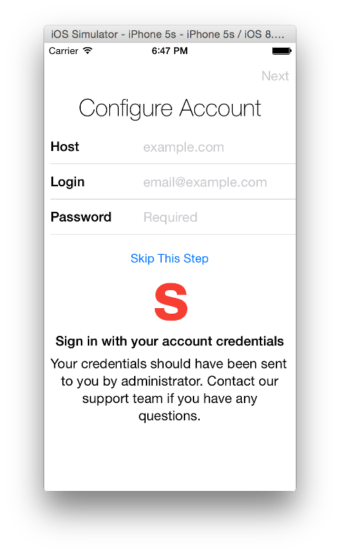
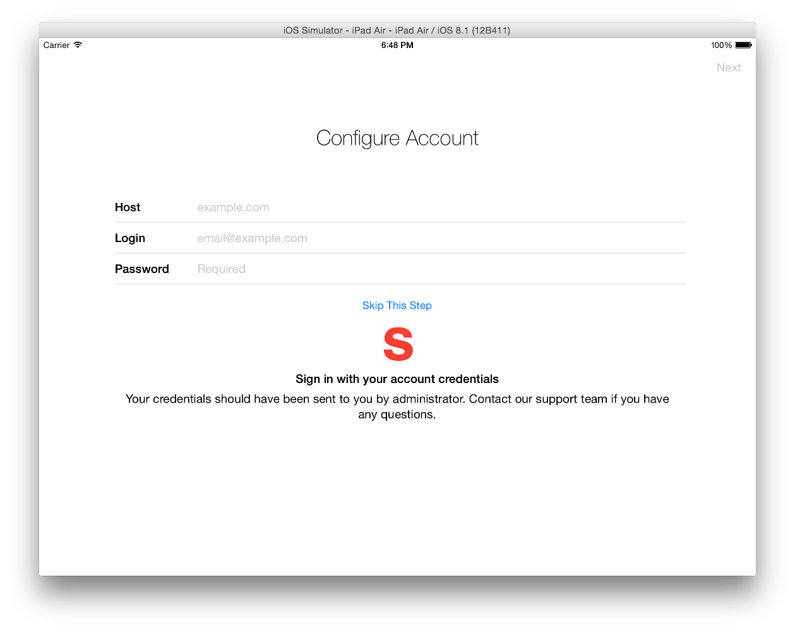

# SetupController

[](https://travis-ci.org/miximka/SetupController)
[](http://cocoadocs.org/docsets/SetupController)
[](http://cocoadocs.org/docsets/SetupController)
[](http://cocoadocs.org/docsets/SetupController)

A `MBSetupController` is a subclass of `UIViewController` controller that acts like a **wizard** or **setup assistant** to present a sequence of dialog views that lead the user through a series of steps.

It has been inspired by the iOS Setup.app application which is presented to user during the first-time device setup.




## Features

- Support for universal iOS8 applications with portrait and landscape orientations.
- A couple of predefined page view controllers like `MBTableViewPageController`, `MBProgressPageController` or `MBFinishPageController` offers a lot of functionality out-of-the-box to quickly build pages for `MBSetupController`.
- Predefined `MBTableViewPageController` use blocks instead of delegate calls to keep the table view's section code in one place, supports autolayout, and autosizing cells (iOS8 feature).

## Demo

A demo project is included in the repository.
To run it, clone the repo, and run `pod install` from the Example directory first.

## Requirements

| Minimum iOS Target | Notes |
|:-:|:-:|
| iOS 8 | - |

## Installation

SetupController is available through [CocoaPods](http://cocoapods.org). To install
it, simply add the following line to your Podfile:

    pod "SetupController"

##Architecture

###Setup View Controller
- `MBSetupController`

###Page View Controllers

- `MBBasePageController`
	- `MBTableViewPageController`
	- `MBProgressPageController`
	- `MBFinishPageController`

###Items and cells for `MBTableViewPageController` 
- `MBSetupPageItem`
	- `MBLabelItem`
	- `MBTextFieldItem`
- `MBSetupPageCell`
	- `MBLabelCell`
	- `MBTextFieldCell`

##Quick Start

###Implement setup controller's data source

1. Subclass `MBSetupController`

	```objc
	@interface MBSampleSetupController : MBSetupController <MBSetupControllerDataSource>
	```

2. Set initial view controller

	```objc
	- (void)viewDidLoad {
	    [super viewDidLoad];
	    MBAccountController *initialController = [[MBAccountController alloc] init];
	    [self setViewControllers:@[initialController] animated:NO];
	}
	```
	

3. Implement `MBSetupControllerDataSource` protocol

	```objc
	- (UIViewController<MBPage> *)setupController:(MBSetupController *)setupController viewControllerAfterViewController:(UIViewController<MBPage> *)viewController {
	    if ([viewController isKindOfClass:[MBAccountController class]]) {
	        MBProgressController *progressController = [[MBProgressController alloc] init];
	        progressController.labelTitle = @"It may take a while to set up your account...";
	        return progressController;
	    }
	    
	    return nil;
	}
	```

###Implement Page View Controller

1. Subclass `MBTableViewPageController `

	```objc
	@interface MBAccountController : MBTableViewPageController
	```
	Next steps are all inside `-viewDidLoad`.
	
	
2. Create section

	```objc
	MBSetupPageSection *section = [MBSetupPageSection sectionWithTitle:@"Configure Account"];
	```

3. Configure section's header

	```objc
	section.headerViewBlock = ^UIView*(MBSetupPageSection *section) {
	    return [weakSelf preparedPageHeaderViewWithTitle:section.title];
	};

	section.headerHeightBlock = ^CGFloat(UITableView *tableView, MBSetupPageSection *section, UIView *view) {
	    CGSize size = [view sizeThatFits:CGSizeMake(tableView.frame.size.width, 0)];
	    return size.height;
	};
	```

4. Configure section's footer

	```objc
	section.footerViewBlock = ^UIView*(MBSetupPageSection *section) {
		MBSectionFooter *footer = [weakSelf preparedFooterViewWithImage:[UIImage imageNamed:@"SampleImage"]
	                                                              title:@"Sign in with your account credentials"
	                                                           subtitle:@"Your credentials should have been sent to you by administrator. Contact our support team if you have any questions."];
	    [footer.topButton setTitle:@"Skip This Step" forState:UIControlStateNormal];
	    [footer.topButton addTarget:weakSelf action:@selector(skip) forControlEvents:UIControlEventTouchUpInside];
	    return footer;
	};
	
	section.footerHeightBlock = ^CGFloat(UITableView *tableView, MBSetupPageSection *section, UIView *view) {
	    CGSize size = [view sizeThatFits:CGSizeMake(tableView.frame.size.width, 0)];
	    return size.height;
	};
	```

5. Create and configure text field item

	```objc
	MBTextFieldItem *hostItem = [[MBTextFieldItem alloc] initWithTitle:@"Host" text:nil placeholder:@"example.com"];
    hostItem.keyboardType = UIKeyboardTypeURL;
    hostItem.autocorrectionType = UITextAutocorrectionTypeNo;
    hostItem.autocapitalizationType = UITextAutocapitalizationTypeNone;
    hostItem.textDidChangeBlock = ^(MBTextFieldItem *item) {
        [weakSelf validate];
    };
    hostItem.validateBlock = ^BOOL(MBSetupPageItem *item) {
        return [(MBTextFieldItem *)item text].length > 0;
    };
	```

6. Add item to section

	```objc
    section.items = @[hostItem];
	```

7. Set `sections` property of the `MBTableViewPageController`

	```objc
	self.sections = @[section];
	```

###Present Setup Controller

```objc
MBSampleSetupController *setupController = [[MBSampleSetupController alloc] init];
setupController.dataSource = setupController;

[self presentViewController:setupController animated:YES completion:nil];
```

## Author

Maksim Bauer, miximka@gmail.com

## License

SetupController is available under the MIT license. See the LICENSE file for more info.
